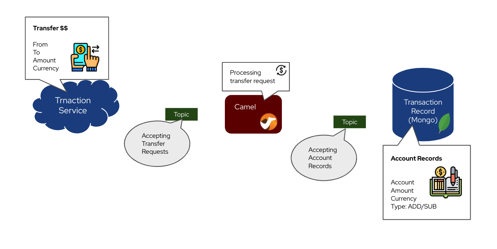
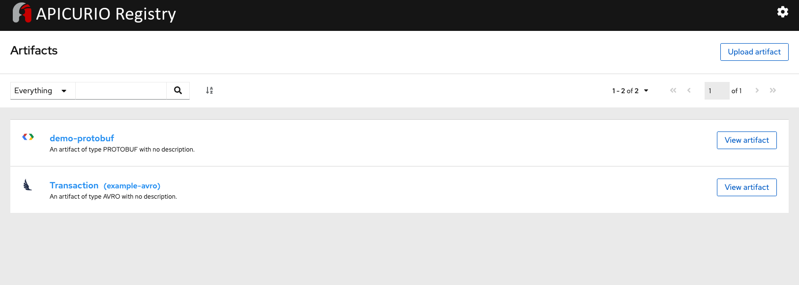
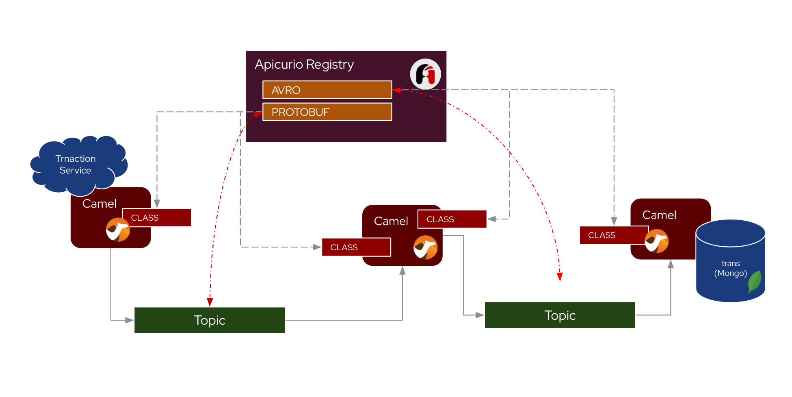

# Contract First App Dev for EDA

Camel using Apicurio Registry to work with Avro and Protobuf schema on Kafka Topics.

Simple money transfer application.
Receives transfer requests from a restful endpoint. And split a transfer request into transaction records, stored in MongoDB. For better bookkeeping purposes. This is a typical event driven implementation, where the topics are responsible for accepting events, and have services subscribing or publishing to the topics.  
In the demo, we have one topic that stores the Transfer Request events, and one stores the Account Record events.




## Environment Installation

#### Kafka (AMQ Streams)
- First you need a Kafka Streaming cluster to store the events.
Download Red Hat's version of Kafka from [here](https://developers.redhat.com/download-manager/file/amq-streams-1.3.0-ocp-install-examples.zip)
- Unzip the file and set the $KAFKA_HOME to the unzip directory.
- Start up the Kafka cluster's broker and zookeeper locally. Also create all the topics needed later.
   `./demo_setup.sh`

#### MongoDB
- Pull down the MongoDB container

  `docker pull mongo`

- Start the MongoBD container

  `docker run -p 27017:27017 -it -v mongodata:/data/db --name mongodb -d mongo`

#### Apicurio Studio

- Pull down the Apicurio Registry

  `docker pull apicurio/apicurio-registry-streams:latest`

- Start the Apicurio Registry

  ```
  docker run -it -p 8080:8080 -e "KAFKA_BOOTSTRAP_SERVERS=host.docker.internal:9092" -e "APPLICATION_ID=myregistry" apicurio/apicurio-registry-streams:latest
  ```


## Upload Schema to Apicurio Registry

In your browser http://localhost:8080/ui/artifacts upload the schema for both topics.

- Upload Protobuf Schema `transaction.proto` with name `demo-protobuf`
- Upload Avro Schema `transaction.avsc` with name `demo-avro`

Apicurio Registry will now able to list and share it among developers.



## Start Up the applications

Start up the 3 applications that are publishing and subscribing events from the topics.
 - First one listens for RESTFul call on port 8081 and convert the JSON file into the _webtrans_ topic that accepts transfer request and needs to serialized data in the form of *protobuf*.

 - Second one subscribes to the _webtrans_ topic deserialize the data from protobuf, splits the request into two separate transaction records. And publish both to the _transrec_ topic and serialized data in the form of *protobuf*.

- Third one simply subscribes to the _transrec_ topic deserialize the data from avro, and place the incoming data directly into MongoDB.




##### OPTION A: Running Camel on Java Main and using the Apicurio Registry Libraries for Serde before sending to Kafka Topics.

- Start REST to protobuf, in a new terminal, go to folder *camel-demo-restprotobuf*
`
- Start protobuf to avro, in a new terminal, go to folder *camel-demo-protobuf2avro*

  run `mvn compile exec:java`
- Start avro to json (MongoDB), in a new terminal, go to folder *camel-demo-avro2mongo*

  run `mvn compile exec:java`

And you should have three Camel applications running

##### OPTION B: Running Camel on Quarkus and using Camel Built-in DataFormat component to marshal and unmarshal data before sending to Kafka Topics.

- Start REST to protobuf, in a new terminal, go to folder *camel-quarkus-restprotobuf*

  run `mvn compile quarkus:dev`
- Start protobuf to avro, in a new terminal, go to folder *camel-quarkus-protobuf2avro*

  run `mvn compile quarkus:dev`
- Start avro to json (MongoDB), in a new terminal, go to folder *camel-quarkus-avro2mongo*

  run `mvn compile quarkus:dev`

And you should have three Camel applications running

### Request to transfer

This works on both options, you can now issue a transfer request:

```
curl -XPOST -H "Content-type: application/json" -d '{
    "transactionid": "A010383",
    "transactiontype": "NORMALADD",
    "sender": {
      "username": "Christina",
      "userid": "chrissy"
    },

    "currency": "USD",
    "amt": 100.0,
    "receiverid": "Franz"
 }' 'localhost:8081/transfer'
```

You will be able to see the result in the MongoDB

In a new broswer, connect to the MongoDB container

```
docker exec -it mongodb bash
```

And find the data by using the following command.
```
use example
db.transaction.find({})
```

You should be able to see two records appear in the transaction table.

```
{ "_id" : ObjectId("5fa437d052afae2d0c6c8246"), "userid" : "chrissy", "transactionid" : "A010383", "transactiontype" : "SUB", "currency" : "USD", "amt" : "100.0" }
{ "_id" : ObjectId("5fa437d052afae2d0c6c824a"), "userid" : "Franz", "transactionid" : "A010383", "transactiontype" : "ADD", "currency" : "USD", "amt" : "100.0" }
```


### Resources
Read more on how to implement them in the *Contract First* way with the schema from Apicurio Registry.

- Blog 1
- Blog 2
- Blog 3

And see things in action with following videos

- Video 1
- Video 2
- Video 3
